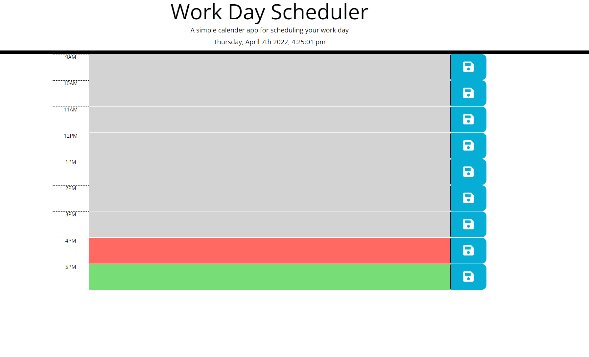
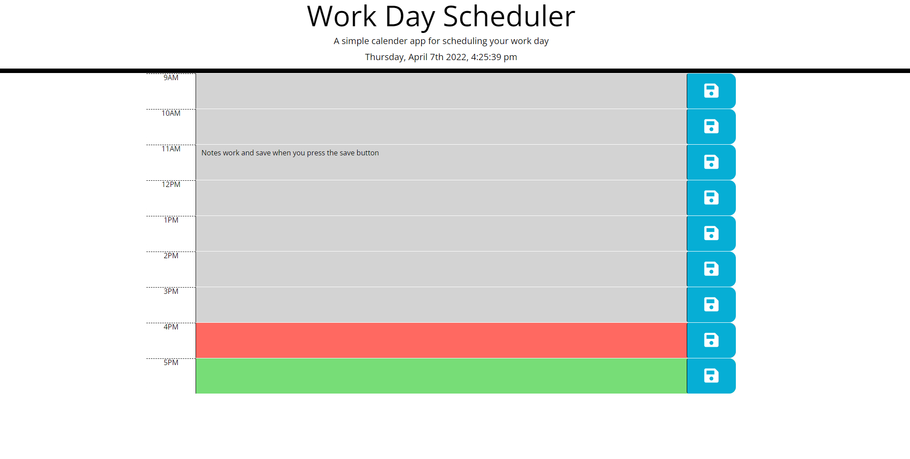
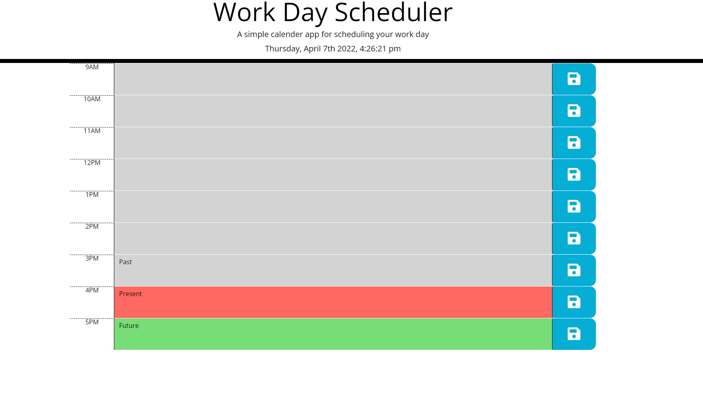

# Day-Planner

Deployed site:https://phillip48.github.io/Day-Planner/  

## Day planner Explained
Many of us have very busy work days. This work day scheduler is built on functions and if statements to help you plan your day throughout work wihtout losing any notes take on the planner. This is done with local storage. The colors changes depending on the time. Gray for past, red for present and green for future. The if statements run conditional statements to see what color needs to change. This is done with a clock at the top of the page. 

Screenshot 1:

Screenshot 2:

Screenshot 3:

